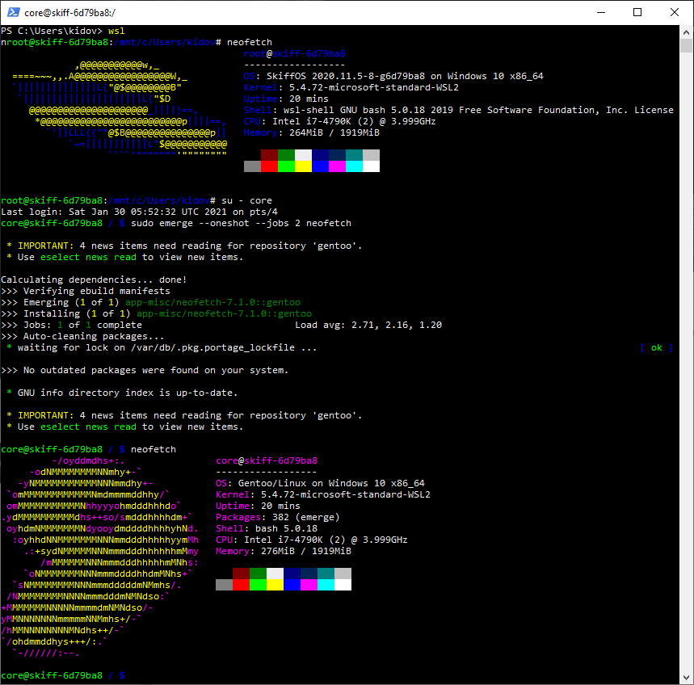

# SkiffOS on Windows Subsystem for Linux



This is a WSL App for [SkiffOS] based on [WSL-DistroLauncher].

[SkiffOS]: https://github.com/skiffos/skiffos
[WSL-DistroLauncher]: https://github.com/Microsoft/WSL-DistroLauncher

## Getting Started

Follow the instructions in the **virt/wsl** package in SkiffOS.

Included here for convenience:

```
export SKIFF_CONFIG=virt/wsl,core/nixos
make compile
cp ./workspaces/default/images/rootfs.tar.gz ../WSL-DistroLauncher/x64/install.tar.gz
```

Open the DistroLauncher sln, edit SkiffOS.appxmanifest, packaging tab,
create a new self-signed certificate.

Right click the solution and select "Deploy Solution" to 
install WSL-SkiffOS on your system.

Run the "WSL-SkiffOS" program, which will register SkiffOS in WSL 1.0
and start a session in the "core" container.

You can convert the distribution to WSL 2.0 at a later time.
